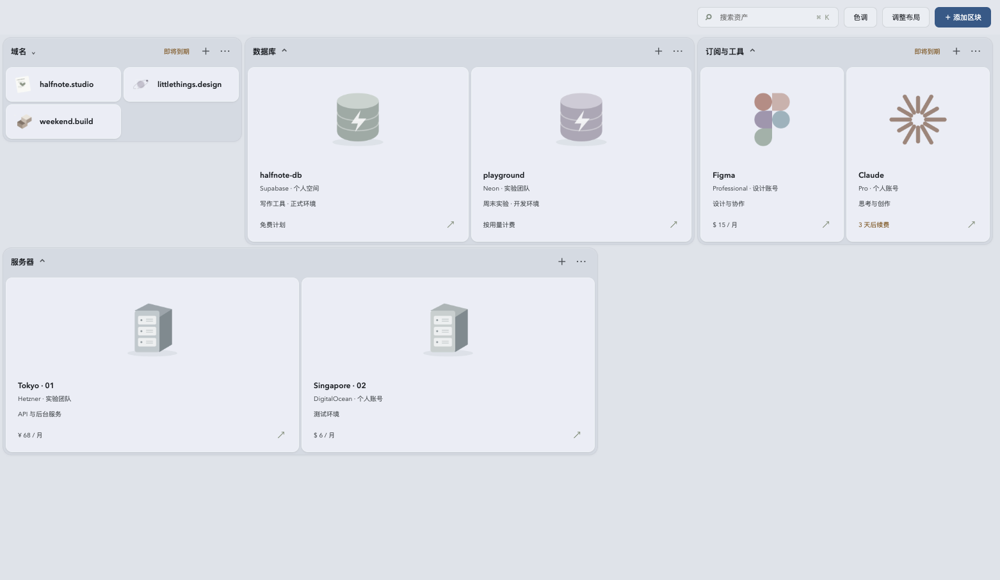

# Assetboard

Assetboard 是一个本地数字资产大板原型，用来整理域名、服务器、订阅和数据库等资产。它提供原生 macOS 窗口，也可以直接在浏览器中体验。



## 下载与运行

从 [v0.1.0 Release](https://github.com/hippone/assetboard/releases/tag/v0.1.0) 下载 `Assetboard-macOS-arm64-0.1.0.zip`，解压后打开 `Assetboard.app`。当前仅提供 Apple Silicon 版本，最低系统版本为 macOS 12。

v0.1.0 使用 Developer ID 签名，已通过 Apple 公证并装订票据。每个后续版本是否通过公证，以对应 Release 的说明为准。

## 当前支持

- 按类别查看资产，搜索、折叠区块和打开详情。
- 添加与编辑区块、资产，调整布局、拖动排序、缩放与撤销。
- macOS 版将资产和布局保存在 `~/Library/Application Support/Assetboard/board.json`，保存前保留 `board.previous.json`；“文件”菜单可导出 JSON 备份或打开数据文件夹。

应用内置的是**演示资产**。平台入口目前不会连接真实账户，也不会创建或修改外部资源。macOS 数据保存在本机的明文 JSON 中，不会上传到云端；请自行保护设备并定期导出备份。当前没有多设备同步、后端或真实平台接入。

## 从源码运行

在仓库根目录执行 `./desktop/build.sh`，输出位于 `dist/Assetboard.app`。这个命令默认使用本机临时签名。要使用自己的 Developer ID Application 证书生成 ZIP：

```sh
SIGNING_IDENTITY='Developer ID Application: Your Name (TEAMID)' ./desktop/package.sh
```

浏览器原型可通过 `python3 -m http.server 4317 --bind 127.0.0.1` 启动，然后访问 <http://127.0.0.1:4317>。浏览器版的修改保存在当前浏览器的 localStorage。

更多交互与验证记录见 [PROTOTYPE.md](PROTOTYPE.md)。
