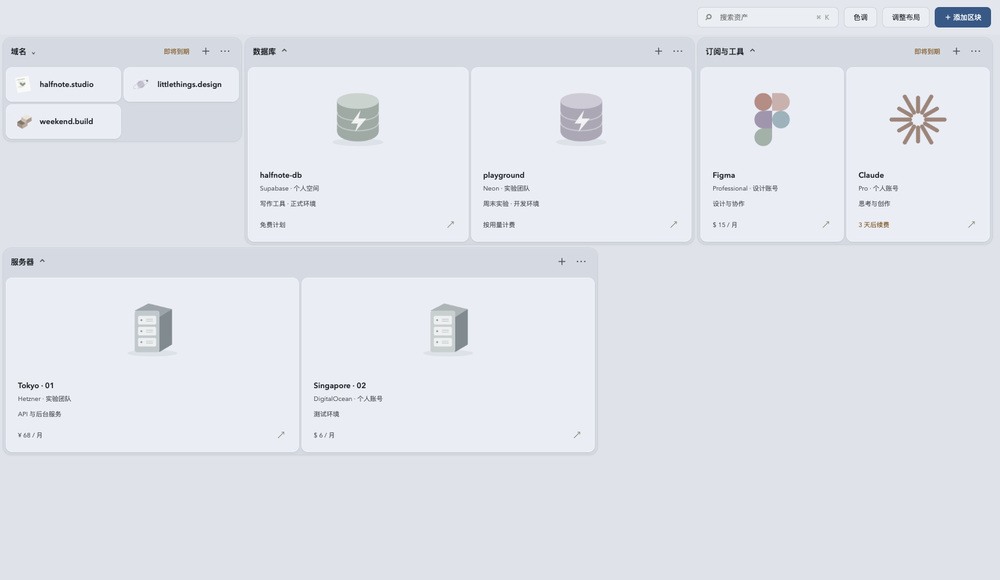

# Assetboard

Assetboard 是一个本地数字资产大板原型，用来整理域名、服务器、订阅和数据库等资产。它提供原生 macOS 窗口，也可以直接在浏览器中体验。



## 下载与运行

从 [v0.1.0 Release](https://github.com/hippone/assetboard/releases/tag/v0.1.0) 下载 `Assetboard-macOS-arm64-0.1.0.zip`，解压后打开 `Assetboard.app`。当前仅提供 Apple Silicon 版本，最低系统版本为 macOS 12。

v0.1.0 使用 Developer ID 签名，已通过 Apple 公证并装订票据。每个后续版本是否通过公证，以对应 Release 的说明为准。

以下“当前支持”描述仓库源码构建；v0.1.0 发布包仍保留当时的演示内容。

## 当前支持

- 按类别查看资产，搜索、折叠区块和打开详情。
- 首次打开是空资产板，可手动录入；macOS App 的首次导入页还提供 GitHub、Cloudflare、Gmail 和截图/PDF 入口。
- 添加与编辑区块、资产；在“调整布局”中拖动或拉伸区块、拖动卡片手柄或用方向键调整卡片顺序，支持撤销。
- 手动录入资产名称、平台、账号、用途、日期、费用、备注、管理链接和自定义 PNG/JPEG/WebP 图标（不超过 256 KB）。管理链接须为 HTTP(S)，由默认浏览器打开。
- macOS App 的“文件 → Cloudflare 只读接入…”使用 API Token 读取授权范围内的 DNS Zone、Pages 项目、Worker 脚本和 R2 Bucket 列表。权限不足的类别会跳过并说明原因，已导入记录不会因此删除；令牌验证成功后保存在 macOS 钥匙串。
- macOS App 的“文件 → GitHub 只读接入…”可使用本机已登录的 GitHub CLI，或填写 GitHub 令牌，同步授权范围内仓库的名称、归属、可见性、归档状态和仓库链接。推荐仅授予仓库 Metadata Read 权限的细粒度令牌；使用本机 `gh` 时，实际权限取决于已有令牌。`gh` 路径不会将令牌另存到 Assetboard 钥匙串，手动填写的令牌经验证后会保存。
- 仓库区块按 GitHub 最近更新时间展开显示 6 个，其余压成图标与名称；点击“展开”或“收起”可在两组间互换，并保留选择。
- macOS App 可从本机截图/PDF 识别文字，以及通过本机 Google OAuth 只搜索 Gmail 账单、续费和服务通知；结果保存在 SQLite 的导入资料中，供核对，不自动推断为资产。Gmail 设置见 [本地 Gmail 导入](docs/gmail-local.md)。
- macOS 版以 `~/Library/Application Support/Assetboard/assetboard.sqlite` 保存资产、布局及导入资料，同时维护 `board.json` 和 `board.previous.json` 作为可读备份；“文件”菜单可导出 JSON 备份或打开数据文件夹。

当前构建不再预装演示资产。升级时只移除与旧版原始内容完全一致的演示记录和未改动的默认区块；编辑过的记录及自定义布局保留。旧 `board.json` 首次打开时迁入 SQLite；JSON 镜像保存前将上一份写入 `board.previous.json`，后续保存会覆盖该备份。手动录入的资产可填写真实链接。Cloudflare 的 Zone 不等于注册记录，不能由此推断域名到期日或账单；其他资源也只读列表元数据，不读取脚本代码或 R2 对象。GitHub 接入只读取仓库元数据，不读取代码、密钥或账单。macOS SQLite、JSON 镜像和自定义图标均留在本机，不上传到 Assetboard 服务。浏览器版本支持手动录入，暂不支持平台同步、OCR 或 Gmail。当前没有多设备同步或后端。请按需导出备份。

Cloudflare 令牌建议在[官方 API Token 页面](https://dash.cloudflare.com/profile/api-tokens)新建，按需授予 **Zone Read、Account Read、Pages Read、Workers Scripts Read、R2 Storage Read** 并限定资源范围。App 只调用对应列表的 GET 接口，按资源标识更新，保留本地备注、图标和管理链接。未获授权的类别不会被标记为缺失；已完整查询的类别中未返回的旧记录会标记出来，不会自动删除。要彻底撤销访问，需在 Cloudflare 后台删除该令牌。

GitHub 令牌建议在平台后台新建**细粒度个人访问令牌**，只选择需要同步的仓库，仓库权限仅保留 **Metadata: Read**。App 仅请求 `GET /user/repos`，同步全部分页后按仓库 ID 更新，并保留本地备注、图标和管理链接。部分组织仓库需管理员批准令牌；列表只反映该令牌可访问的范围。断开本机连接不会自动撤销 GitHub 后台的令牌。

## 从源码运行

在仓库根目录执行 `./desktop/build.sh`，输出位于 `dist/Assetboard.app`。这个命令默认使用本机临时签名。要使用自己的 Developer ID Application 证书生成 ZIP：

```sh
SIGNING_IDENTITY='Developer ID Application: Your Name (TEAMID)' ./desktop/package.sh
```

浏览器原型可通过 `python3 -m http.server 4317 --bind 127.0.0.1` 启动，然后访问 <http://127.0.0.1:4317>。浏览器版的修改保存在当前浏览器的 localStorage。

更多交互与验证记录见 [PROTOTYPE.md](PROTOTYPE.md)。
